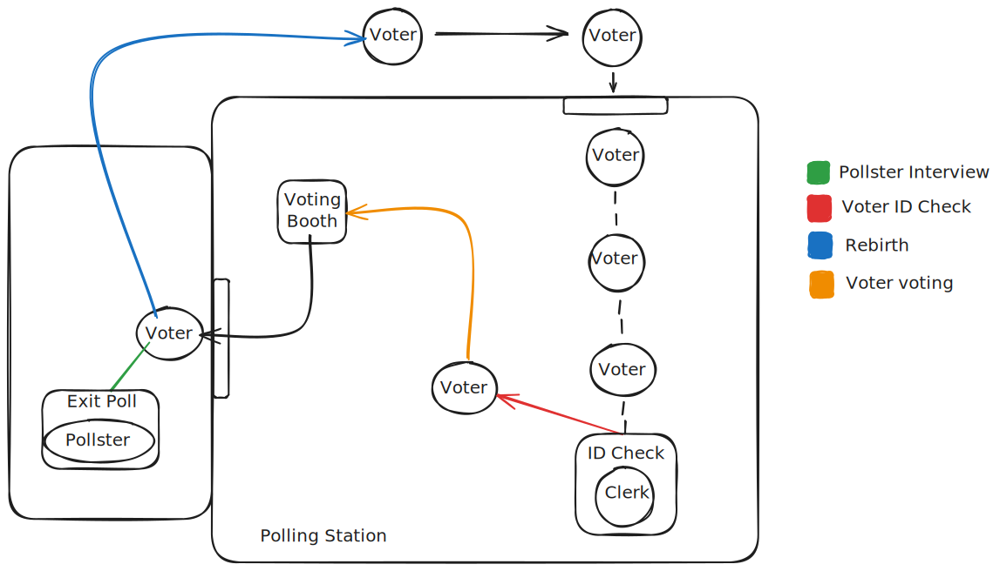

# SD practical assignment
## Voting System Simulation

This project implements a distributed voting system simulation with multiple components communicating through a message-passing architecture and Java sockets. The system simulates the complete voting process from entry verification to vote casting and post-voting polling.

## System Overview

The voting system consists of several servers and client entities that work together to simulate a real-world voting process:

## Servers

- Polling Station Server: Controls voter entry into the polling station, maintaining a limited capacity;

- ID Check Server: Helps verifying voter IDs together with Clerk Client to prevent duplicate voting;

- Voting Booth Server: Receives and counts votes for candidates;

- Pollster Server: Helps Pollster Client with talking with Voter Clients for polls.

## Clients

- Voter Client: Simulates voters entering the polling station, voting, optionally participating in exit polls, and being reborn for re-entry;

- Clerk Client: Processes voter ID verification requests;

- Pollster Client: Conducts exit polls with voters.

## Workflow

As illustrated in the [SD_SCHEMA.svg](SD_SCHEMA.svg) diagram, the system workflow is:

  1. Entry Process: Voters enter the polling station (if capacity permits).
  2. ID Verification: Clerks verify voter IDs to ensure no duplicate voting.
  3. Voting Process: Approved voters proceed to voting booths to cast votes.
  4. Exiting Polling Station: Voters leave the polling station after voting;
  5. Respond Pollster: Voters may participate in exit polls conducted by pollsters.
  6. Reborn: After Pollster Station, the voter is reborn and can re-enter the polling station.

The system implements communication between components using Java sockets and a message-passing protocol. Each component runs as a separate process, simulating a distributed system.

## Key Features

- Thread-based concurrency for handling multiple simultaneous voters
- Capacity constraints on the polling station
- Duplicate vote prevention through ID verification
- Two-party voting system (DRP and NKDP parties)
- Optional exit polling based on a probability factor
- Graphical user interface for monitoring all server and client processes

## Messages Classes

The system implements a message-passing architecture to facilitate communication between distributed components. All messages inherit from the base Message class and are categorized by their MessageType. The key message types include:

### Connection Messages

- ConnectMessage: Establishes connection between clients and servers

- DisconnectMessage: Signals client disconnection

### Polling Station Messages

- AllowEntranceMessage: Signals a voter is allowed to enter the polling station

### ID Verification Messages

- IDRequestMessage: Clerk requests a voter ID to verify

- IDRequestResp: Server responds with voter ID for verification

- CheckIDRequesteMessage: Requests validation of a voter ID

- CheckIDResponseMessage: Returns ID validation result
- CanVoteMessage: Informs voter if they can proceed to vote

### Voting Messages

- VoteMessage: Contains a voter's selected candidate

### Exit Poll Messages

- InterviewRequestMessage: Request to interview a voter

- InterviewResponseMessage: Response to interview request

- PollRequestMessage: Request for exit poll participation

- PollResponseMessage: Voter's response to exit poll

For detailed message formats and examples, refer to the [Example_msg.md](Example_msg.md) file, which contains JSON representations of all message types used in the system.

# How to run the code
```bash

# Compile the code
make all

# Stay on the same directory as the makefile

make gui

# This will run the GUI and the code

```

