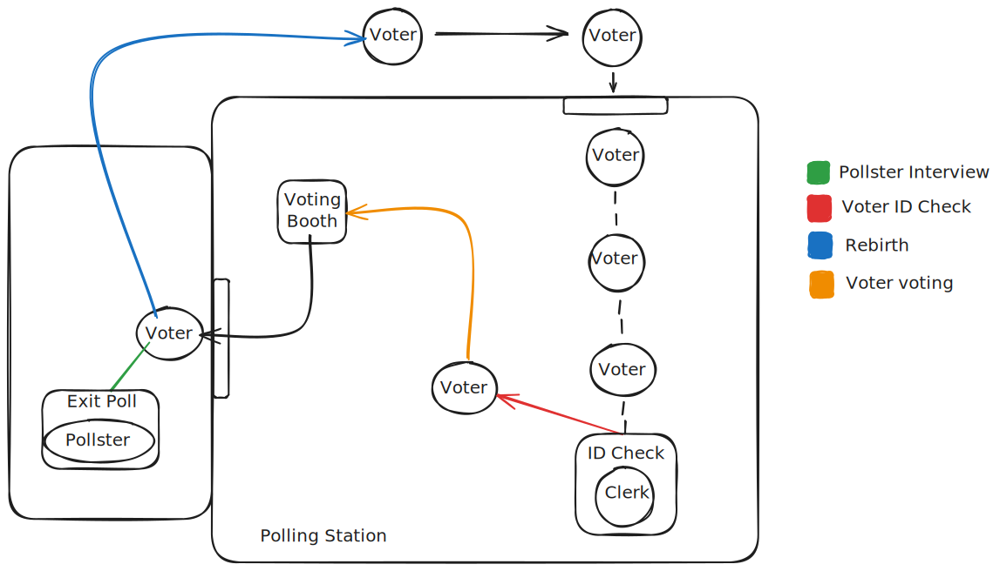

# SD practical assignment

## Voting System Simulation
<!-- This project implements a distributed voting system simulation with multiple components communicating through a message-passing architecture and Java sockets. The system simulates the complete voting process from entry verification to vote casting and post-voting polling.  but with rmi-->
This project implements a distributed voting system simulation with multiple components communicating through Java RMI. The system simulates the complete voting process from entry verification to vote casting and post-voting polling.

## What is Java RMI?
Java RMI (Remote Method Invocation) is a Java API that allows an object running in one Java Virtual Machine (JVM) to invoke methods on an object running in another JVM. It enables remote communication between distributed applications, allowing them to interact as if they were local objects.

## System Overview
The system consists of the following components:

### Servers
- **Polling Station Server**: Controls Voter entry into the polling station, maintaining a limited capacity;
- **ID Check Server**: Helps verifying voter IDs together with Clerk Client to prevent duplicate voting;
- **Voting Booth Server**: Receives and counts votes for candidates;
- **Pollster Server**: Helps Pollster Client with talking with Voter Clients for polls.

### Clients

- **Voter Client**: Simulates voters entering the polling station, voting, optionally participating in exit polls, and being reborn for re-entry;
- **Clerk Client**: Processes voter ID verification requests;
- **Pollster Client**: Conducts exit polls with voters.

### Workflow

As illustrated in the [SD_SCHEMA.svg](SD_SCHEMA.svg) diagram, the system workflow is:

1. Entry Process: Voters enter the polling station (if capacity permits).
2. ID Verification: Clerks verify voter IDs to ensure no duplicate voting.
3. Voting Process: Approved voters proceed to voting booths to cast votes.
4. Exiting Polling Station: Voters leave the polling station after voting;
5. Respond Pollster: Voters may participate in exit polls conducted by pollsters.
6. Reborn: After Pollster Station, the voter is reborn and can re-enter the polling station.



## How to run code

```bash

# Compile the code
make clean
make

# Stay on the same directory as the makefile

make gui

# This will run the GUI and the code

```

**Note**: When pressing "Start" button on either the client or the server, if you get an error about the address already being in use, click the "Kill RMI Port (1099)" button to free the port.
